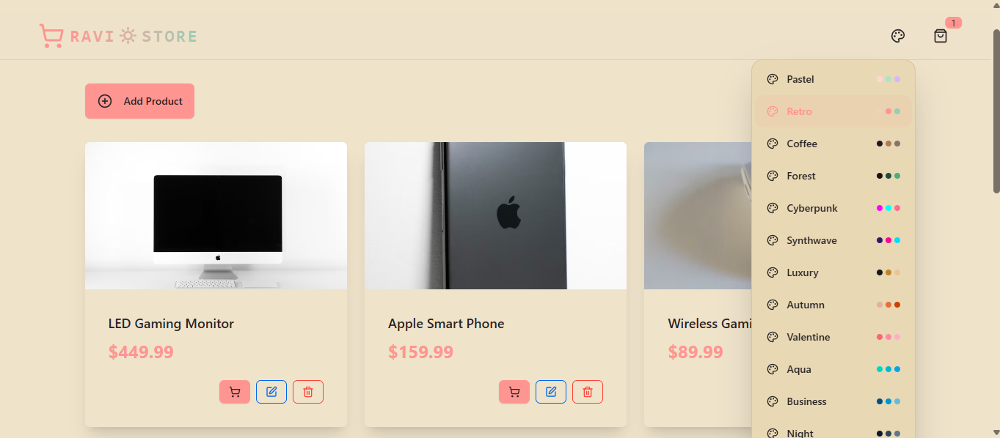
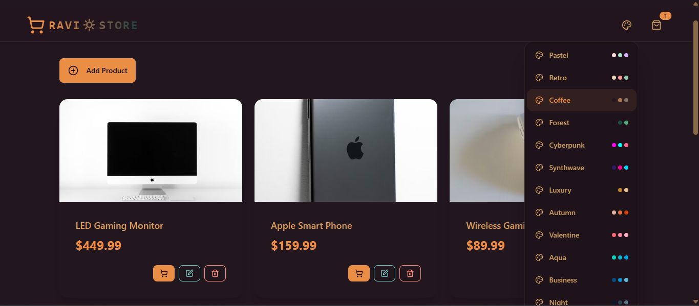
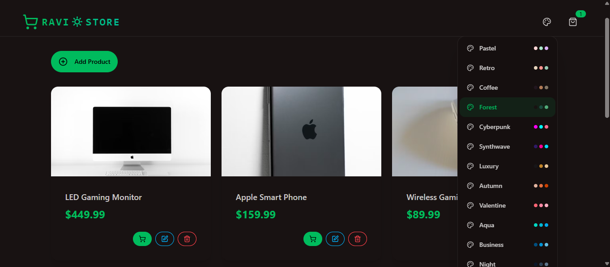
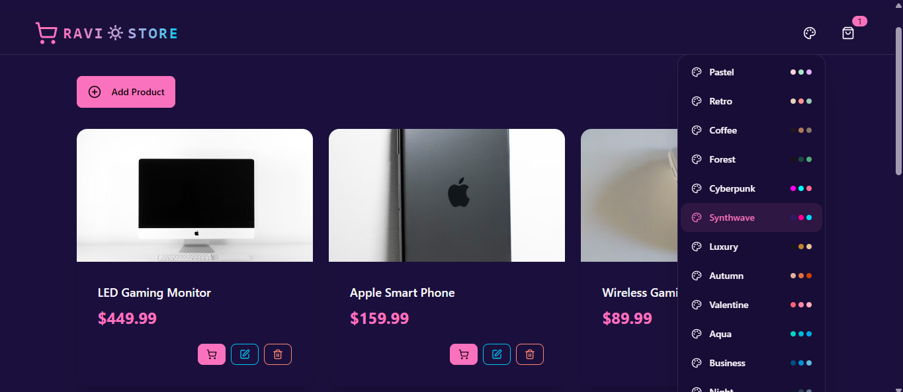
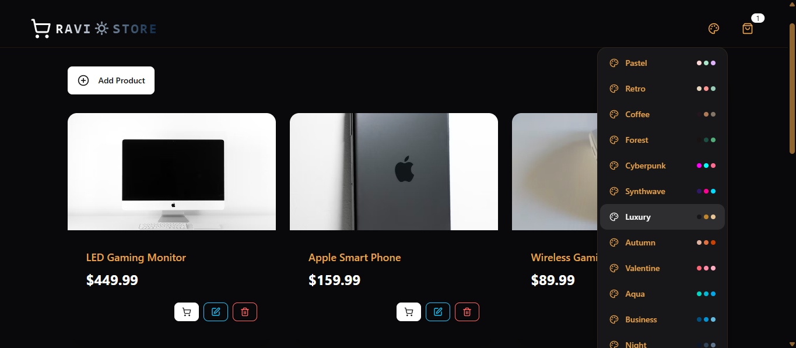
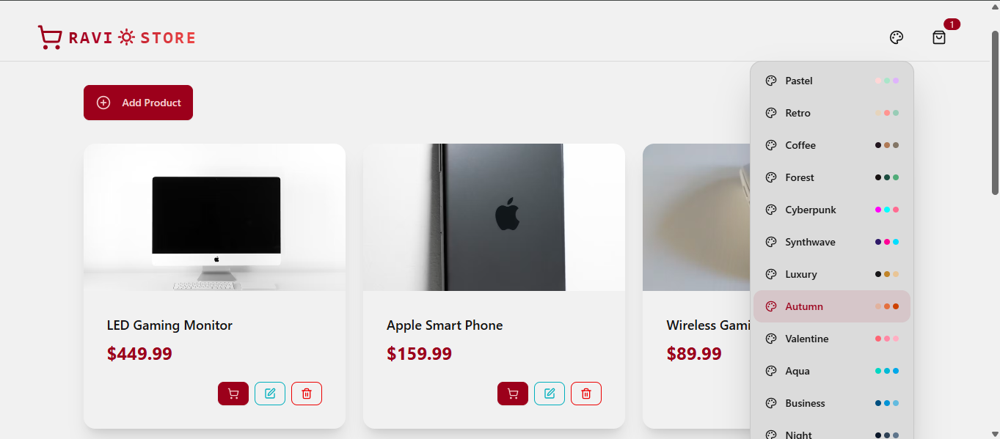
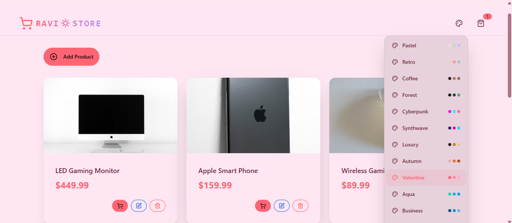
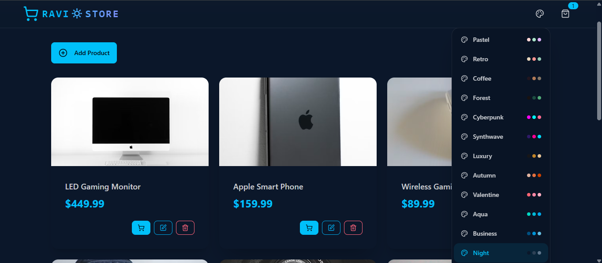
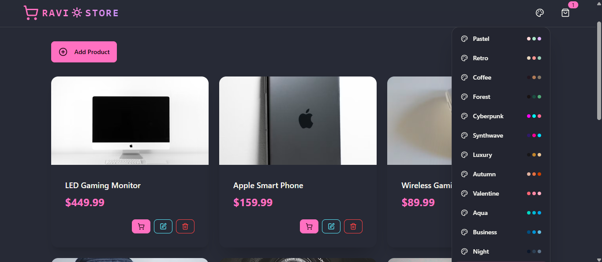

# 🛒 RAVI🔆STORE - PERN Ecommerce Application



A modern, full-stack e-commerce platform built with the **PERN Stack** (PostgreSQL, Express.js, React, Node.js). This application features product management, a dynamic shopping cart, multiple customizable themes, and a responsive user interface. It includes security features like rate limiting, authentication middleware, and a sleek frontend with animations and notifications.

## 🌟 Features

- **Product Management**: Add, edit, delete, and view products with image uploads.
- **Shopping Cart**: Add items to cart, update quantities, remove items, and calculate totals.
- **Theme Selector**: Choose from 40+ beautiful themes including retro, coffee, forest, synthwave, luxury, and more.
- **Responsive Design**: Optimized for desktop, tablet, and mobile devices.
- **Security**: Rate limiting with Arcjet, Helmet for security headers, CORS, and Morgan for logging.
- **Database**: PostgreSQL with NeonDB for scalable data storage.
- **Frontend**: React with Vite, Tailwind CSS, DaisyUI, Zustand for state management, React Router for navigation, Axios for API calls, and Lucide icons.
- **Backend**: Express.js with modular routes, controllers, and middleware.
- **Animations**: Smooth transitions using Framer Motion.
- **Notifications**: Toast notifications with React Hot Toast.

## 🎨 Theme Gallery

Here are all the beautiful themes available in RAVI🔆STORE, displayed as actual images:

<div align="center">

**Retro Theme**  


**Coffee Theme**  


**Forest Theme**  


**Synthwave Theme**  


**Luxury Theme**  


**Autumn Theme**  


**Valentine Theme**  


**Night Theme**  


**Dracula Theme**  


**Default Light Mode**  


**Default Dark Mode**  


**Vintage & Warm Theme**  


</div>

## 🚀 Tech Stack

### Frontend
- **React** - UI library
- **Vite** - Build tool
- **Tailwind CSS** - Styling
- **DaisyUI** - Component library
- **Zustand** - State management
- **React Router** - Navigation
- **Axios** - HTTP client
- **Lucide React** - Icons
- **React Hot Toast** - Notifications
- **Framer Motion** - Animations

### Backend
- **Node.js** - Runtime
- **Express.js** - Web framework
- **PostgreSQL** - Database (via NeonDB)
- **Arcjet** - Rate limiting
- **Helmet** - Security
- **Morgan** - Logging
- **CORS** - Cross-origin resource sharing
- **Dotenv** - Environment variables

## 📁 Project Structure

```
e:/PERN/
├── backend/
│   ├── server.js                 # Main server file
│   ├── config/
│   │   └── db.js                 # Database configuration
│   ├── controllers/
│   │   ├── product.controller.js # Product logic
│   │   └── ...                   # Other controllers
│   ├── lib/
│   │   ├── arcjet.js             # Rate limiting setup
│   │   ├── cloudinary.js         # Image upload (if used)
│   │   ├── db.js                 # DB connection
│   │   ├── redis.js              # Caching
│   │   └── stripe.js             # Payments
│   ├── routes/
│   │   ├── productRoutes.js      # Product routes
│   │   └── ...                   # Other routes
│   ├── seeds/
│   │   └── products.js           # Sample data
│   └── middleware/                # Custom middleware
├── frontend/
│   ├── public/
│   │   ├── retro.png             # Theme images
│   │   ├── coffee.png
│   │   └── ...                   # Other theme images
│   ├── src/
│   │   ├── App.jsx               # Main app component
│   │   ├── main.jsx              # Entry point
│   │   ├── index.css             # Global styles
│   │   ├── components/
│   │   │   ├── Navbar.jsx        # Navigation bar
│   │   │   ├── ProductCard.jsx   # Product display
│   │   │   ├── ThemeSelector.jsx # Theme picker
│   │   │   └── ...               # Other components
│   │   ├── pages/
│   │   │   ├── HomePage.jsx      # Product listing
│   │   │   ├── CartPage.jsx      # Shopping cart
│   │   │   └── ...               # Other pages
│   │   ├── store/
│   │   │   ├── useCartStore.js   # Cart state
│   │   │   ├── useProductStore.js# Product state
│   │   │   └── useThemeStore.js  # Theme state
│   │   └── constants/
│   │       └── index.js          # Theme definitions
│   ├── package.json              # Frontend dependencies
│   ├── vite.config.js            # Vite config
│   └── tailwind.config.js        # Tailwind config
├── package.json                  # Root dependencies
├── TODO.md                       # Task list
└── README.md                     # This file
```

## 🛠️ Installation & Setup

1. **Clone the repository**:
   ```bash
   git clone https://github.com/Ravi19092004/RAVISTORE.git
   cd RAVISTORE
   ```

2. **Install dependencies**:
   ```bash
   npm install
   cd frontend && npm install && cd ..
   ```

3. **Set up environment variables**:
   - Create `.env` in backend/ with database URL, etc.
   - Configure NeonDB, Cloudinary, Stripe, etc.

4. **Run the application**:
   ```bash
   npm run dev  # Runs both frontend and backend concurrently
   ```

5. **Build for production**:
   ```bash
   npm run build
   npm start
   ```

## 📝 Scripts

- `npm run dev` - Start development server (frontend + backend)
- `npm run build` - Build frontend for production
- `npm start` - Start production server

## 🤝 Contributing

Contributions are welcome! Please fork the repository and submit a pull request.

## 📄 License

This project is licensed under the ISC License.

---

**Made with ❤️ by Ravi** | [GitHub](https://github.com/Ravi19092004) | [LinkedIn](https://linkedin.com/in/ravishankar-gharabidi-35bb2b262)
=======
# 🛒 RAVI🔆STORE - PERN Ecommerce Application


A modern, full-stack e-commerce platform built with the **PERN Stack** (PostgreSQL, Express.js, React, Node.js). This application features product management, a dynamic shopping cart, multiple customizable themes, and a responsive user interface. It includes security features like rate limiting, authentication middleware, and a sleek frontend with animations and notifications.

## 🌟 Features

- **Product Management**: Add, edit, delete, and view products with image uploads.
- **Shopping Cart**: Add items to cart, update quantities, remove items, and calculate totals.
- **Theme Selector**: Choose from 40+ beautiful themes including retro, coffee, forest, synthwave, luxury, and more.
- **Responsive Design**: Optimized for desktop, tablet, and mobile devices.
- **Security**: Rate limiting with Arcjet, Helmet for security headers, CORS, and Morgan for logging.
- **Database**: PostgreSQL with NeonDB for scalable data storage.
- **Frontend**: React with Vite, Tailwind CSS, DaisyUI, Zustand for state management, React Router for navigation, Axios for API calls, and Lucide icons.
- **Backend**: Express.js with modular routes, controllers, and middleware.
- **Animations**: Smooth transitions using Framer Motion.
- **Notifications**: Toast notifications with React Hot Toast.

## 🎨 Theme Gallery

Here are all the beautiful themes available in RAVI🔆STORE, displayed as actual images:

<div align="center">

**Retro Theme**  


**Coffee Theme**  


**Forest Theme**  


**Synthwave Theme**  


**Luxury Theme**  


**Autumn Theme**  


**Valentine Theme**  


**Night Theme**  


**Dracula Theme**  


**Default Light Mode**  


**Default Dark Mode**  


**Vintage & Warm Theme**  


</div>

## 🚀 Tech Stack

### Frontend
- **React** - UI library
- **Vite** - Build tool
- **Tailwind CSS** - Styling
- **DaisyUI** - Component library
- **Zustand** - State management
- **React Router** - Navigation
- **Axios** - HTTP client
- **Lucide React** - Icons
- **React Hot Toast** - Notifications
- **Framer Motion** - Animations

### Backend
- **Node.js** - Runtime
- **Express.js** - Web framework
- **PostgreSQL** - Database (via NeonDB)
- **Arcjet** - Rate limiting
- **Helmet** - Security
- **Morgan** - Logging
- **CORS** - Cross-origin resource sharing
- **Dotenv** - Environment variables

## 📁 Project Structure

```
e:/PERN/
├── backend/
│   ├── server.js                 # Main server file
│   ├── config/
│   │   └── db.js                 # Database configuration
│   ├── controllers/
│   │   ├── product.controller.js # Product logic
│   │   └── ...                   # Other controllers
│   ├── lib/
│   │   ├── arcjet.js             # Rate limiting setup
│   │   ├── cloudinary.js         # Image upload (if used)
│   │   ├── db.js                 # DB connection
│   │   ├── redis.js              # Caching
│   │   └── stripe.js             # Payments
│   ├── routes/
│   │   ├── productRoutes.js      # Product routes
│   │   └── ...                   # Other routes
│   ├── seeds/
│   │   └── products.js           # Sample data
│   └── middleware/                # Custom middleware
├── frontend/
│   ├── public/
│   │   ├── retro.png             # Theme images
│   │   ├── coffee.png
│   │   └── ...                   # Other theme images
│   ├── src/
│   │   ├── App.jsx               # Main app component
│   │   ├── main.jsx              # Entry point
│   │   ├── index.css             # Global styles
│   │   ├── components/
│   │   │   ├── Navbar.jsx        # Navigation bar
│   │   │   ├── ProductCard.jsx   # Product display
│   │   │   ├── ThemeSelector.jsx # Theme picker
│   │   │   └── ...               # Other components
│   │   ├── pages/
│   │   │   ├── HomePage.jsx      # Product listing
│   │   │   ├── CartPage.jsx      # Shopping cart
│   │   │   └── ...               # Other pages
│   │   ├── store/
│   │   │   ├── useCartStore.js   # Cart state
│   │   │   ├── useProductStore.js# Product state
│   │   │   └── useThemeStore.js  # Theme state
│   │   └── constants/
│   │       └── index.js          # Theme definitions
│   ├── package.json              # Frontend dependencies
│   ├── vite.config.js            # Vite config
│   └── tailwind.config.js        # Tailwind config
├── package.json                  # Root dependencies
├── TODO.md                       # Task list
└── README.md                     # This file
```

## 🛠️ Installation & Setup

1. **Clone the repository**:
   ```bash
   git clone https://github.com/Ravi19092004/RAVISTORE.git
   cd RAVISTORE
   ```

2. **Install dependencies**:
   ```bash
   npm install
   cd frontend && npm install && cd ..
   ```

3. **Set up environment variables**:
   - Create `.env` in backend/ with database URL, etc.
   - Configure NeonDB, Cloudinary, Stripe, etc.

4. **Run the application**:
   ```bash
   npm run dev  # Runs both frontend and backend concurrently
   ```

5. **Build for production**:
   ```bash
   npm run build
   npm start
   ```

## 📝 Scripts

- `npm run dev` - Start development server (frontend + backend)
- `npm run build` - Build frontend for production
- `npm start` - Start production server

## 🤝 Contributing

Contributions are welcome! Please fork the repository and submit a pull request.

## 📄 License

This project is licensed under the ISC License.

---

**Made with ❤️ by Ravi** | [GitHub](https://github.com/Ravi19092004) | [LinkedIn](https://linkedin.com/in/ravishankar-gharabidi-35bb2b262)
=======
# RAVISTORE---PERN-Ecommerce-Application
A modern, feature-rich e-commerce platform built with the PERN stack (PostgreSQL, Express.js, React, Node.js). Features comprehensive product management, dynamic shopping cart, 40+ customizable themes, responsive design, and robust security with rate limiting. Includes beautiful UI with animations, toast notifications, and a complete backend API.
>>>>>>> e8db9e3a7fdcb39fd3e9d185791dae9216fe4276
